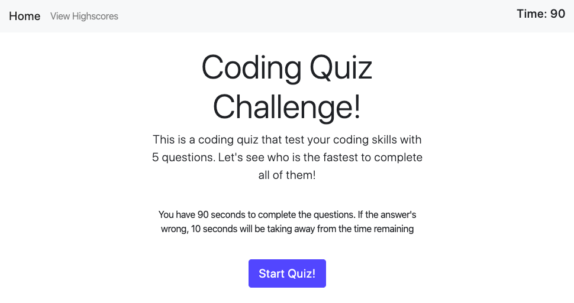
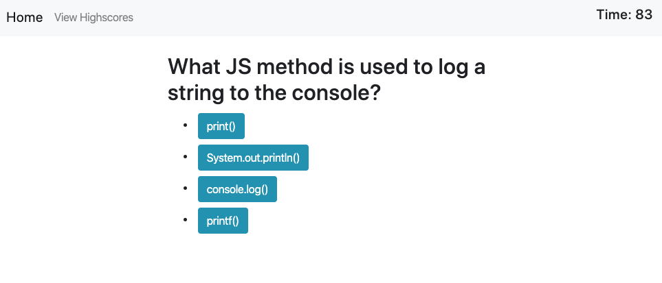
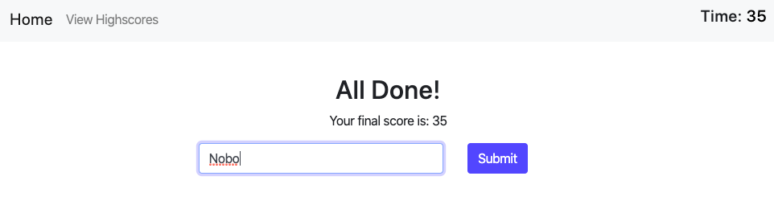
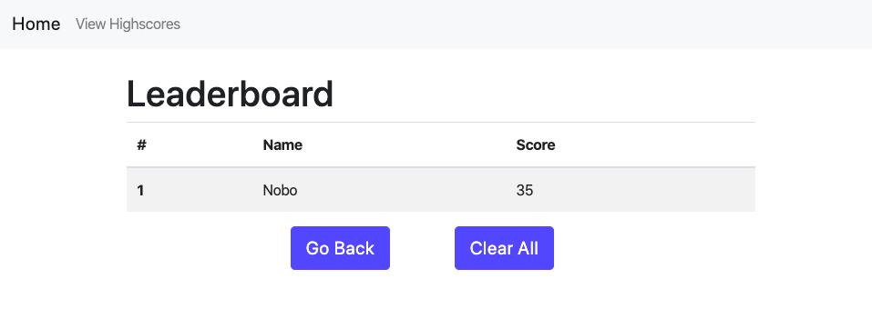

# Code Quiz!
Application Link: https://nobobobo.github.io/code-quiz/

## Introduction

### This application shows multple choice questions as a coding a quiz. 

### Users are given the specific time (90s) to answer the quesitons.

### Final remaining time is used as a score and can be submitted to the leaderboard. 

### The leaderboard displays stored scores for previous users. 

## How it works

* The questions are pre-defined in Javascript script, and it renders out each question in order by manupulating DOM elements from JS script. 

* Time interval is created once the user starts the quiz. And a wrong answer subtracts 10 seconds from remaining time. 

* Each button rendered on a question section has a event listener to detect click event then check the answer is correct or not. 

* Once the user finished the quiz, the application diplays final remaining time as his/her score.

* The user can type his/her name to form section to submit to the leaderboard.  

* After the submission, JS script stores it to localstorage item, which can be loaded to render score table in a leaderboard page.
